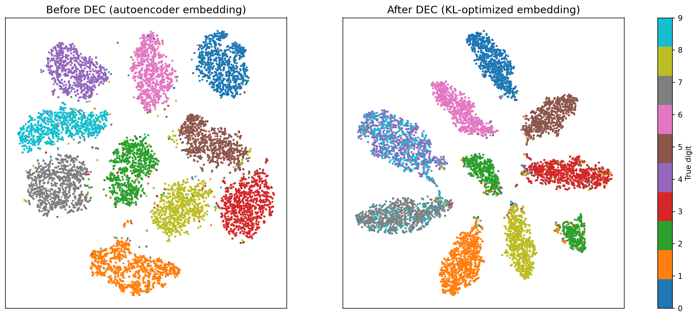
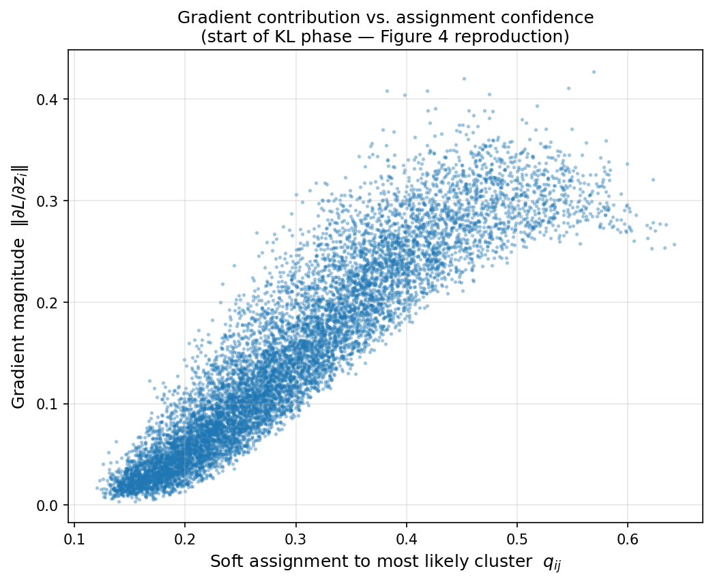

# DEC Paper Reproduction — Unsupervised Deep Embedding for Clustering Analysis

PyTorch reproduction of **"Unsupervised Deep Embedding for Clustering Analysis"**
by Junyuan Xie, Ross Girshick, Ali Farhadi (ICML 2016).
[Paper link](https://proceedings.mlr.press/v48/xieb16.pdf)

## What is DEC?

Classical clustering (e.g., k-means) operates directly on raw features, where
distances are often meaningless — two images of the same digit can be far apart
in pixel space. DEC instead **learns a feature space and cluster centroids
simultaneously**, using a two-phase approach:

1. **Initialization:** A stacked denoising autoencoder (784–500–500–2000–10)
   is pretrained layer-wise and finetuned end-to-end. The decoder is then
   discarded, and k-means on the embedded data provides initial centroids.
2. **Clustering:** Soft assignments between embedded points and centroids are
   computed with a Student's t-distribution (Eq. 1). A sharpened **target
   distribution** (Eq. 3) is derived from the model's own confident
   predictions, and both the encoder weights and the centroids are jointly
   optimized by minimizing **KL(P‖Q)** (Eq. 2) — a form of self-training.
   Training stops when < 0.1% of points change cluster between iterations.

## Results (MNIST, 70,000 images)

Two pretraining schedules were evaluated: the **paper's exact schedule**
(SGD lr=0.1, momentum 0.9, 50,000 iterations per layer + 100,000 finetuning
iterations, lr ÷10 every 20,000 iterations) and a **modern reduced schedule**
(Adam lr=1e-3, 25 epochs/layer + 60 finetuning epochs).

| Method | Paper | This repro — paper schedule | This repro — Adam schedule |
|---|---|---|---|
| AE + k-means | 81.84% | 75.94% | 77.00% |
| DEC w/o backprop | 79.82% | — | 75.82% |
| **DEC** | **84.30%** | **80.05%** (NMI 0.748) | **81.61%** (NMI 0.834) |

The paper's core claim reproduces clearly under both schedules: the
KL-divergence clustering phase improves accuracy by **+4.1 to +4.6 points**
over the autoencoder + k-means baseline. A second independent Adam-schedule
run scored 82.28% ACC / 0.850 NMI, indicating stability across random
initializations.

### Embedded space visualization (Figure 5 reproduction)



t-SNE projection of the 10-d embedded space (10,000 sampled points, colored by
true digit; Adam-schedule weights). The KL-divergence phase visibly compacts
and separates clusters compared to the raw autoencoder embedding. The main
remaining confusion is the overlapping 4/9 region — a known hard case that
also limits the original paper.

### Gradient contribution vs. confidence (Figure 4 reproduction)



Per-point gradient magnitude ‖∂L/∂z‖ against soft assignment confidence q,
measured at the start of the KL phase. Gradient contribution grows with
confidence — confident points dominate the learning signal, validating the
paper's self-training formulation of the target distribution.

## Reproduction insights

- **Full paper iterations did not close the gap — the optimizer schedule,
  not the iteration count, is the binding constraint.** Under the paper's
  exact schedule, the aggressive lr decay (÷10 every 20k iterations) reduces
  the learning rate to ≤1e-4 for the entire second half of training;
  finetuning reconstruction loss plateaus at 0.0534, versus 0.0359 under
  Adam. The Adam-schedule DEC (81.61%) consequently outperforms the
  paper-schedule DEC (80.05%) in this implementation. The residual gap to
  the published 84.30% most plausibly stems from framework-era differences
  the paper does not fully specify (Caffe weight initialization, per-layer
  dropout details).
- **First run failed informatively.** With a short Adam pretraining
  (15 epochs/layer, 30 finetune epochs), the autoencoder was undertrained
  (finetune loss still falling at cutoff) and results collapsed to
  ACC ≈ 64%. DEC could only add +1.4 points — confirming that **DEC refines
  an embedding but cannot rescue a poor one**. Training longer
  (25 epochs/layer, 60 finetune epochs) recovered the expected behavior.
- **Ablation confirms joint optimization is essential.** With the encoder
  frozen (no backprop into f_θ), centroid-only optimization slightly
  *degrades* performance over iterations (77.1% → 75.8%), while full DEC
  gains +4.6 points. The improvement comes from the feature space
  reorganizing itself, not from centroid movement alone — the paper's
  central claim, reproduced.

## Deviations from the paper

| Aspect | Paper | This repro | Reason |
|---|---|---|---|
| Framework | Caffe | PyTorch | Modern standard |
| Pretraining schedule | SGD 50k iters/layer + 100k finetune | Both implemented: paper schedule (`--schedule paper`) and Adam alternative (`--schedule fast`) | Full-fidelity comparison |
| Datasets | MNIST, STL-10, REUTERS | MNIST | STL-10 requires a dated HOG pipeline; full REUTERS is memory-prohibitive |

## Repository structure

```
src/
  autoencoder.py             # SAE: layer-wise pretrain + finetune (fast and paper schedules)
  dec.py                     # DEC model: soft assignment (Eq.1), target distribution (Eq.3), KL loss (Eq.2)
  metrics.py                 # Unsupervised clustering accuracy (Hungarian algorithm), NMI
  train.py                   # Full pipeline: pretrain -> k-means init -> KL optimization
experiments/
  visualize_tsne.py          # Figure 5: t-SNE of embedded space before vs after DEC
  ablation_no_backprop.py    # Table 2 ablation: frozen encoder, centroid-only updates
  gradient_plot.py           # Figure 4: gradient magnitude vs assignment confidence
  02_dec_mnist_colab.ipynb   # Colab notebook with full training logs
results/
  figures/                   # Generated figures
```

## How to run

```bash
pip install -r requirements.txt

# Reduced Adam schedule (~1 hour on a Colab T4 GPU)
python -m src.train

# Paper-faithful schedule (~4-6 hours; resumable via persistent checkpoints)
python -m src.train --schedule paper --ckpt_dir /path/to/persistent/storage

# After training (uses the saved sae_pretrained.pth / dec_final.pth):
python -m experiments.ablation_no_backprop   # Table 2 ablation
python -m experiments.visualize_tsne         # Figure 5 visualization
python -m experiments.gradient_plot          # Figure 4 gradient analysis
```

The paper schedule checkpoints after every stage and resumes automatically,
so interrupted runs (e.g., Colab session resets) continue where they left off.
On Colab, point `--ckpt_dir` at a mounted Google Drive folder.

## Reference

Xie, J., Girshick, R., & Farhadi, A. (2016). *Unsupervised Deep Embedding for
Clustering Analysis.* ICML 2016.

---

*Reproduced by [Tanishka Pagar](https://github.com/TanishkaPagar) as part of a
research internship at LABTECH.*